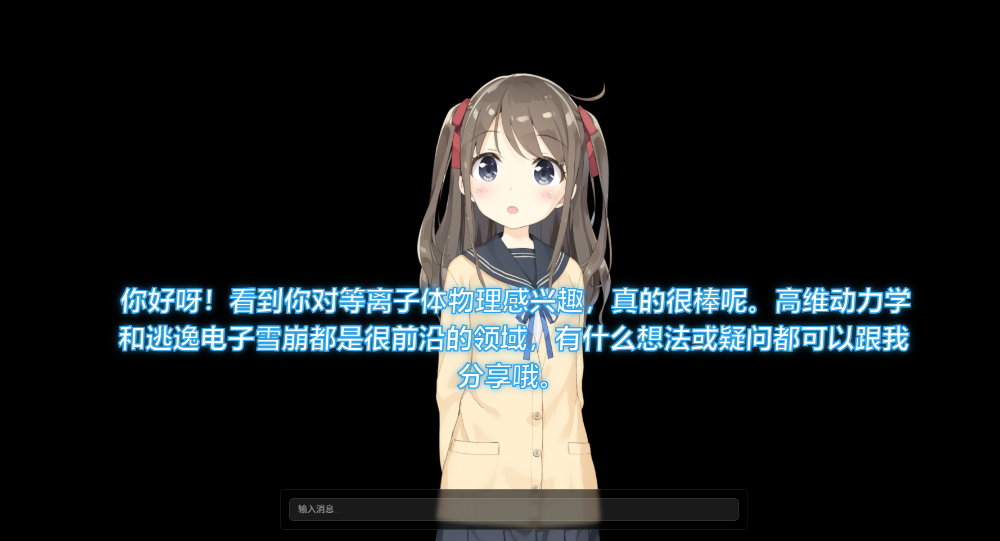

# GEEK-AGENT-LIVE2D
从项目https://github.com/mewamew/nana 魔改而来，删掉了原项目中的embedding做法，就让ai用一句话'user_info'记下用户信息，提升了项目的可靠性。




## 安装说明

### 环境准备

- Node.js: v22 以上
- Python: 3.10 以上

确保你的系统已经安装了以上版本的环境，才能顺利运行本项(或者其他版本也可以，但我没试过)

### 后端配置
- LLM和向量模型的配置见backend/config.py
- 线上模型使用通义qwen-plus，需要去阿里云百炼注册账号并获取API Key，添加到环境变量中
- TTS服务使用了Fish Audio的API，需要注册账号并获取API Key
- https://fish.audio/zh-CN/
- 如果不想使用TTS，可以把FISH_API_KEY设置为空字符串


### 前端安装
```bash
cd frontend
npm install
```

### 后端安装
```bash
cd backend
# 创建虚拟环境
python -m venv venv
# Windows激活虚拟环境
.\venv\Scripts\activate
# Linux/Mac激活虚拟环境
source venv/bin/activate

# 安装依赖
pip install fastapi uvicorn openai python-dotenv
```

## 运行说明

### 启动前端
```bash
cd frontend
npm run dev
```
前端将在 http://localhost:3000 启动

### 启动后端
```bash
cd backend
uvicorn main:app --reload --host 0.0.0.0 --port 8000
```
后端API将在 http://localhost:8000 启动


### 其他说明
- 角色设定保存在backend/prompts/reply.txt文件夹中，可以自行修改
- live2d模型是原作者在工坊买的，仅供学习交流使用，请勿用于商业用途！！！
- 如果在运行过程中遇到什么问题，欢迎来原作者的主页留意 https://space.bilibili.com/3546572358945017


```
+------------------+     +-------------------+     +----------------+
|                  |     |                   |     |                |
|  ChatService     | --> |   MainAgent       | --> |   LLMService   |
| generate_reply() |     | reply(),          |     | generate_      |
|                  |     | _generate_reply() |     | response()     |
+------------------+     +-------------------+     +----------------+
        ↓                         ↓                        ↓
   Prepare Context         Build Prompt with         Call LLM API
                             Memory & History
        ↓                         ↓                        ↓
   Return Response       Process LLM Response     Send Request to
                            and Update History       Remote Server
```                            